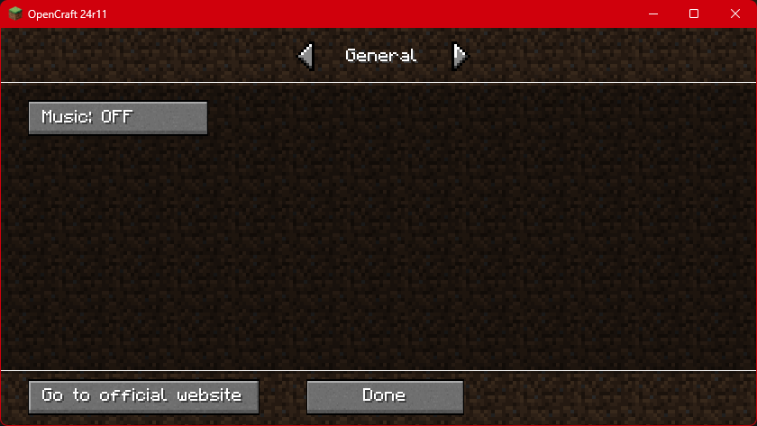
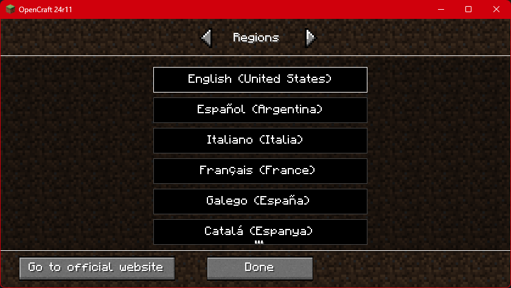

[![Contributors][contributors-shield]][contributors-url]
[![Forks][forks-shield]][forks-url]
[![Stargazers][stars-shield]][stars-url]
[![Issues][issues-shield]][issues-url]
[![MPL License][license-shield]][license-url]

<br />
<div align="center">
  <a href="https://github.com/OpenCraft-Studios/LWJGL-Edition">
    
  </a>

  <h3 align="center">OpenCraft</h3>

  <p align="center">
    A roughly calculated clone of Minecraft
    <br /><br />
    <a href="https://github.com/OpenCraft-Studios/LWJGL-Edition/wiki"><strong>Explore the docs »</strong></a>
    <br />
    <b>
      <a href="https://github.com/OpenCraft-Studios/LWJGL-Edition/issues">REPORT BUGS</a>
      •
      <a href="https://github.com/OpenCraft-Studios/LWJGL-Edition/pulls">FEATURE REQUEST</a>
    </b>
  </p>
</div>

> [!WARNING]
> This project **IS NOT** affiliated with Mojang or other minecraft product. <br />
> This is just a hobby and I do not take care of any uses provided to this utility.

> ```FOR SUPPORT:``` https://github.com/OpenCraft-Studios/LWJGL-Edition/issues/ <br />
> ```FOR CONTRIBUTING:``` https://github.com/OpenCraft-Studios/LWJGL-Edition/pulls


---

<div align='center'>
  
### Quick Links
  
<a href="☕-downloading">
  
</a>
  
</div>

---
<br />

## ✅ Getting started
**OpenCraft** is a game programmed on Java and I want to create a community around this project,
I hope that you can be part of that community forking the repository or simply, bring us a star :heart:

<details open>
  <summary>Screenshots</summary><br />
  <p align="center">
    &nbsp;
    
  </p>
  <div align="center">
    
    <p><b>+6 languages</b></p>
  </div>
</details>

## ☕ Downloading
For now, we don't have prebuild jars. You need to compile it manually.
Although you will need a launcher to play the game because it needs of libraries.

> [!NOTE]
> *Every required libraries are open-source and free, so you can download them easily.*

If you don't want to use a launcher, you can execute it manually. Only **follow these steps**:

1. Make sure you have Java **1.8** or above installed: <br />
   `java --version` *= 1.8*

2. Make sure you have the latest version of OpenCraft downloaded.

3. Make sure you have the libraries to execute OpenCraft.

If you are already to execute OpenCraft. Follow these instructions.

**Windows**
```batch
java -cp OpenCraft.jar;libraries.jar; net.opencraft.OpenCraft --gameDir opcraft
```

**Bash**
```bash
#!/bin/bash
java -cp OpenCraft.jar:libraries.jar: net.opencraft.OpenCraft --gameDir opcraft/
```

---

## ♥️ Contributing
> This section makes reference to the file [```CONTRIBUTING.md```](CONTRIBUTING.md)

---

## 👷‍♂️ Developers
| [](https://github.com/CiroZDP) | [](https://github.com/TheNicolasDeveloper) | 	|
| :---------------------------------------------------------------------------------------------: | :---------------------------------------------------------------------------------------------------------: | :-------------------------------------------------------------------------------------------------: |
|                                         **CiroZDP**                                             |                                          **TheNicolasDeveloper**                                            |                                          **The community**                                          |

---

[contributors-shield]: https://img.shields.io/github/contributors/OpenCraft-Studios/LWJGL-Edition.svg?style=for-the-badge
[contributors-url]: https://github.com/OpenCraft-Studios/LWJGL-Edition/graphs/contributors
[forks-shield]: https://img.shields.io/github/forks/OpenCraft-Studios/LWJGL-Edition.svg?style=for-the-badge
[forks-url]: https://github.com/OpenCraft-Studios/LWJGL-Edition/network/members
[stars-shield]: https://img.shields.io/github/stars/OpenCraft-Studios/LWJGL-Edition.svg?style=for-the-badge
[stars-url]: https://github.com/OpenCraft-Studios/LWJGL-Edition/stargazers
[issues-shield]: https://img.shields.io/github/issues/OpenCraft-Studios/LWJGL-Edition.svg?style=for-the-badge
[issues-url]: https://github.com/OpenCraft-Studios/LWJGL-Edition/issues
[license-shield]: https://img.shields.io/github/license/OpenCraft-Studios/LWJGL-Edition.svg?style=for-the-badge
[license-url]: https://github.com/OpenCraft-Studios/LWJGL-Edition/blob/main/LICENSE.txt